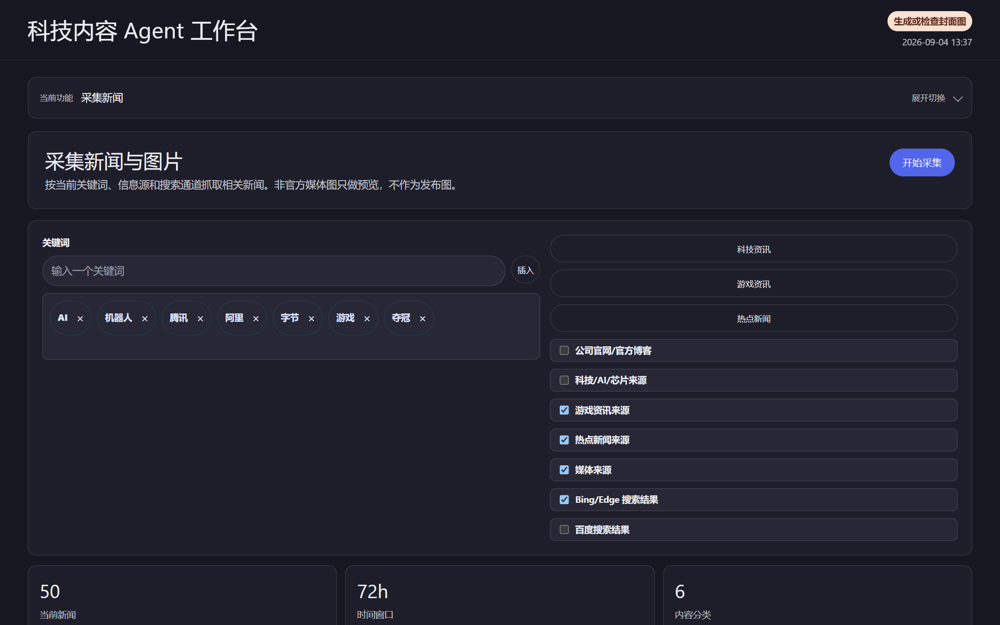
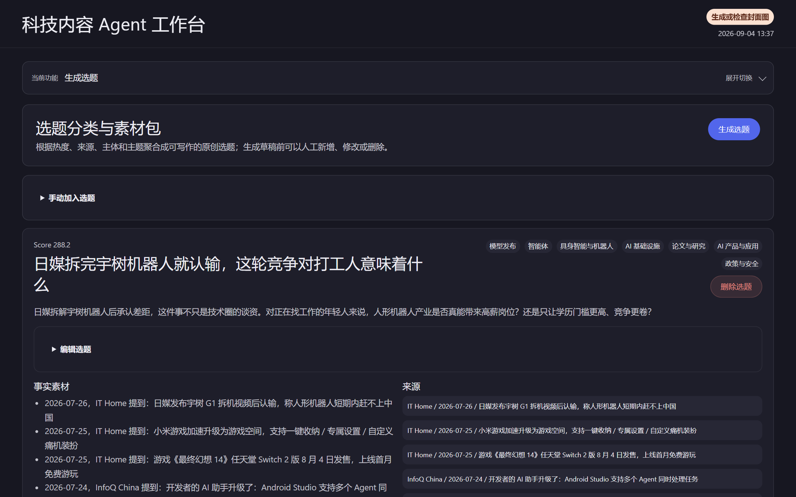
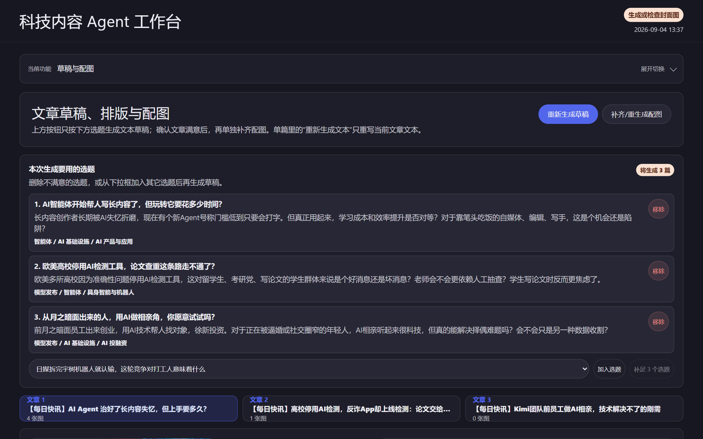
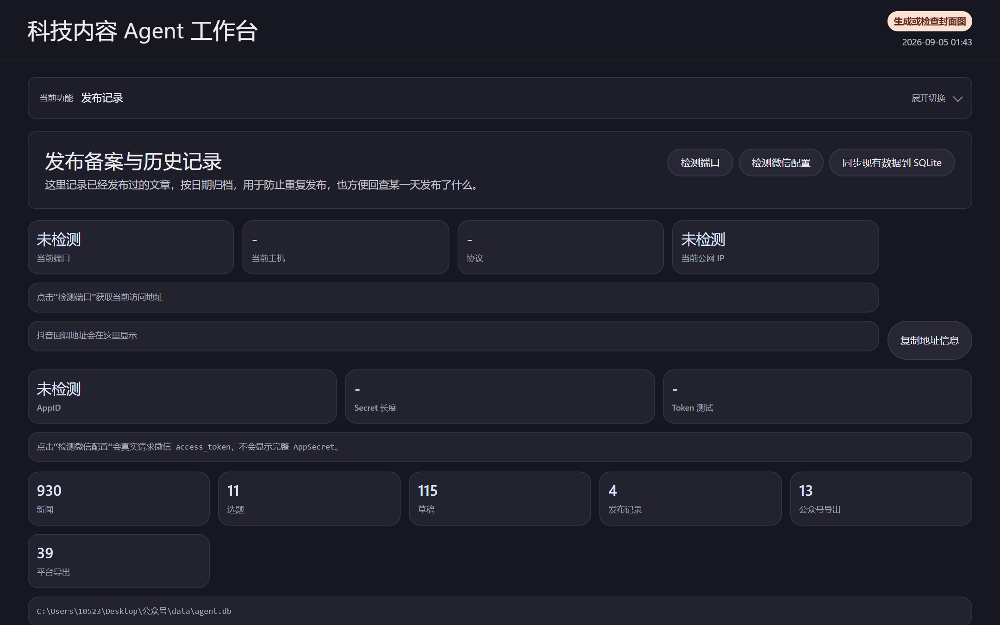
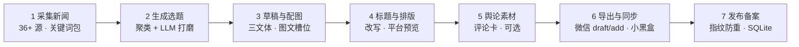

<div align="center">

# Newsmaker · 微信公众号科技内容 AI 采编 Agent

**把「科技新闻」，变成一篇能直接进公众号草稿箱的稿子。**

> 本地运行的 AI 内容工作台：聚合 **36+ 科技信息源** → **AI 选题** → **多文体写作** → **图文配齐** → **微信官方草稿箱一键同步**。
> 大模型负责初稿，编辑器保留对每一行字的最终控制权。

[](https://www.python.org/)
[](https://flask.palletsprojects.com/)
[](https://jinja.palletsprojects.com/)
[](https://www.sqlite.org/)
[](https://playwright.dev/)
[](app/llm_client.py)

[📖 使用手册](docs/usage.md) · [🎨 宣传落地页](docs/index.html) · [🕹️ 小黑盒接入](docs/heybox_integration.md) · [🎬 抖音舆论采集](docs/douyin_opinion_setup.md) · [⭐ 点亮 Star](https://github.com/RoyZ1/newsmaker)

</div>

---

## ✨ 它解决什么问题

公众号 / 科技频道的日更编辑部，一天的真实流程是：**刷几十个站点攒素材 → 手动拟选题 → 让大模型写稿再手工排版 → 到处找配图 → 复制粘贴到后台**。Newsmaker 把这条链路收进一个**本地单页工作台**：

- 📡 **采集**：RSS / 网页 / JSON / Changelog 四类源统一接入，72 小时窗口自动抓取，规则打分（官方源、顶级实体、模型发布、时效性…），Top50 精选入库；
- 🧭 **选题**：对当日素材按实体聚类，LLM 打磨出带「标题 / 角度 / 结构 / 事实清单」的编辑级选题；
- ✍️ **写作**：长文（公众号）/ 短文 / 小黑盒三文体，输出过 JSON Schema 质检，不合格自动带问题清单修复重试；标题批量改写选最优；
- 🖼️ **配图**：按章节自动规划图片槽位，官方原图 / AI 生图 / 官方截图 / 人工上传四路候选，逐张过「清晰度 / 水印 / 重复」审核；
- 💬 **舆论素材**：抖音开放平台授权接口采集评论 → 排版成评论卡片 → 自动生成「舆论与争议」章节；
- 🚀 **发布**：微信走官方 `draft/add` 草稿箱接口整稿同步；小黑盒富文本复制 + 半自动浏览器导入；全部动作留**版本快照 + SQLite 备案 + 发布指纹防重**。

**界面一览（本地真实运行截图）：**

| ① 采集新闻 | ② 选题 |
|---|---|
|  |  |
| **③ 草稿与配图** | **④ 发布记录** |
|  |  |

> 另有独立宣传落地页 [`docs/index.html`](docs/index.html)（可配 GitHub Pages 展示）。

---

## 🔧 工作流（工作台 7 步分页）



## ⚙️ 核心模块

| 目录 / 文件 | 职责 |
|---|---|
| `app/collector.py` | 四类信息源采集、关键词过滤、规则打分、图片策略 |
| `app/topics.py` | 选题聚类与 LLM 选题打磨、人工增删改 |
| `app/writer.py` · `title_writer.py` | 多文体草稿生成、JSON 质检 + 修复重试、标题改写 |
| `app/image_candidates.py` · `cover_images.py` | 图文槽位规划、AI 封面/配图生成、候选管理 |
| `app/official_screenshots.py` | Playwright 截取官方页面图作为配图候选 |
| `app/opinion_materials.py` · `douyin_auth.py` | 抖音授权与公开评论采集、评论卡片图 |
| `app/wechat_export.py` · `wechat_sync.py` | 公众号正文排版 / 图片处理 / 官方草稿箱同步 |
| `app/heybox_export.py` · `heybox_automation.py` | 小黑盒导出与半自动浏览器导入 |
| `app/database.py` · `publication.py` | SQLite 同步回填、发布备案 |
| `app/server.py` | Flask 路由与单页工作台 API |
| `config/sources.yml` | 信息源配置（新增信息源只需约 10 行 YAML） |
| `config/prompts/` | 全部提示词（写作 / 标题 / 人味化 / 配图）均可改 |

## 🚀 快速开始

```powershell
# 1. 克隆
git clone https://github.com/RoyZ1/newsmaker.git
cd newsmaker

# 2. 安装依赖
python -m pip install -r requirements.txt

# 3. 配置 .env（至少填 LLM 三项，任意 OpenAI 兼容大模型均可）
#    LLM_API_KEY=...
#    LLM_MODEL_ID=...
#    LLM_BASE_URL=...
#    （可选：WECHAT_APP_ID/APP_SECRET、IMAGE_* 图模型、抖音 OAuth，见 docs/）

# 4. 启动
python run_server.py
# 打开 http://127.0.0.1:5050（端口默认 5050，.env 的 APP_PORT 可调整）
```

> 小黑盒「半自动导入」需额外执行 `python -m playwright install chromium`。
> 微信公众号同步需在公众号后台把服务器 IP 加入白名单（工作台会给出当前公网 IP 提示）。

## 🧱 技术栈

| 层 | 选型 |
|---|---|
| 后端 | Python 3.12 · Flask 3 · Jinja2 |
| 前端 | 原生 JS 单页工作台（`templates/index.html`），暗色「墨丘利」主题 |
| 采集 | httpx · feedparser · BeautifulSoup4 · PyYAML |
| AI | OpenAI 兼容 `chat/completions`（模型可换）· DashScope 文生图 · 图片用 Pillow 处理 |
| 自动化 | Playwright（官方页截图 / 小黑盒可见浏览器半自动导入） |
| 存储 | JSON 实时数据 + SQLite（`data/agent.db`）+ 按日归档 + 版本快照 |
| 平台接口 | 微信公众平台 API · 抖音开放平台 OAuth · 小黑盒（复制 / 导出 / 半自动） |

## 📁 目录结构

```text
app/                 核心业务代码（采集/选题/写作/配图/导出/同步）
config/              信息源 sources.yml + prompts/ 提示词配置
docs/                宣传页 index.html + 使用与接入文档 + 界面截图
data/                本地数据、图片、SQLite、导出与发布归档
scripts/             collect / write / images / tests 命令行与测试
static/  templates/  前端样式与模板
run_server.py        主入口
```

## 🛡️ 设计原则

- **官方接口优先**：微信 `draft/add` 官方草稿箱、抖音开放平台授权；小黑盒无公开草稿接口 → 导出 + 半自动导入并**停在人工审核，不自动发布**。
- **AI 不签最后一个字**：全部生成物可编辑、可回滚、留版本快照，配图带审核证据。
- **本地即云端**：单机 `127.0.0.1` 运行，密钥只在 `.env`，系统不打印密钥。

## 🗺️ 后续计划

- 大模型摘要与话题聚类增强、热度评分调优
- 候选题人工审核流、更多平台（头条 / 知乎专栏）适配
- 发布后阅读 / 互动数据回填

## 📜 许可

本项目尚未指定开源许可证（如需可提 Issue 讨论）。界面风格参考仓库内 `DESIGN*.md` 设计基准产出。
